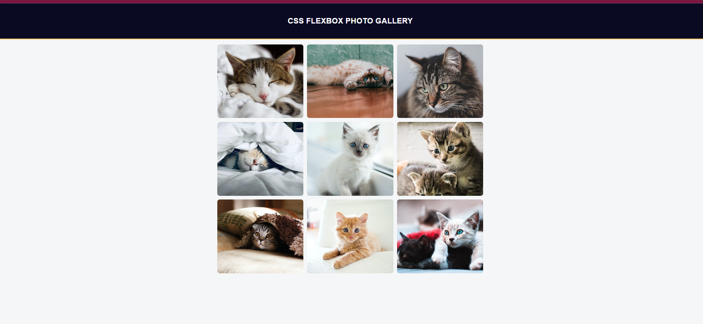

# CSS Flexbox Photo Gallery

This project is a simple photo gallery built using CSS Flexbox layout. It displays a set of images in a responsive grid layout.

## Preview

## Technologies Used

- HTML
- CSS (Flexbox)

## Getting Started

To view the photo gallery, simply open the `index.html` file in a web browser.

## Features

- Responsive grid layout using CSS Flexbox.
- Images are displayed with uniform dimensions and aspect ratios using `object-fit: cover`.
- The gallery is centered horizontally on the page.
- Each image has a maximum width of 350px and a fixed height of 300px.
- Images have rounded corners for aesthetic appeal.

## Project Structure

- `index.html`: HTML file containing the structure of the photo gallery.
- `styles.css`: CSS file containing the styling for the photo gallery.

## Usage

Feel free to use this code as a reference for creating your own photo galleries or as a learning resource to understand CSS Flexbox layout.

## Credits

This project is based on the CSS Flexbox curriculum on [FreeCodeCamp](https://www.freecodecamp.org/).

## License

This project is licensed under the [MIT License](LICENSE).
