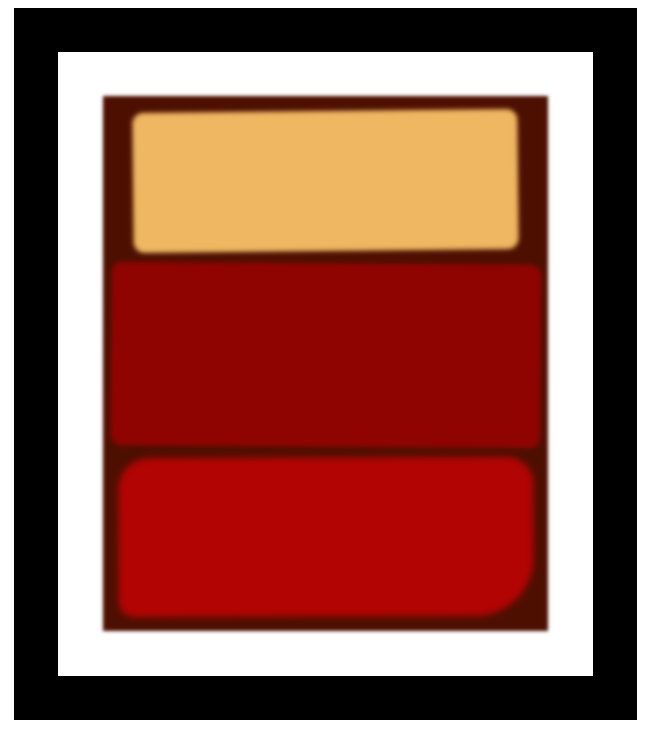

# Rothko Painting

This project is a simple representation of a Rothko-style painting using HTML and CSS. It was created as part of the FreeCodeCamp Responsive Design course.

## Description

The project consists of an HTML file (`index.html`) and a CSS file (`styles.css`). The HTML file defines the structure of the painting, while the CSS file provides the styling.

## Preview

 

## Instructions

To view the painting, simply open the `index.html` file in a web browser.

## Technologies Used

- HTML
- CSS

## Credits

This project was created as part of the FreeCodeCamp Responsive Design course.

## License

This project is licensed under the [MIT License](LICENSE).
